# Neomount - Rclone + MergerFS Docker Container

A Docker container that provides a unified filesystem using rclone and mergerfs, with automatic daily synchronization from local to remote storage.

## Features

- **Rclone Mount**: Mounts any rclone-supported remote (Google Drive, S3, etc.)
- **MergerFS Overlay**: Provides a merged view with local filesystem overlaid on remote
- **Write-Local Strategy**: All writes go to local storage for fast performance
- **Daily Move Job**: Automatically moves files from local to remote on a schedule
- **Supervisor Management**: All services managed by supervisord for reliability

## Architecture

```mermaid
graph TD
    A["Merged Filesystem<br/>/mnt/merged<br/>(Use this for your applications)"]
    B["Local Storage<br/>/mnt/local<br/>(Read/Write)<br/>Fast Local Storage"]
    C["Rclone Mount<br/>/mnt/rclone<br/>(Read Only)<br/>Cloud Remote<br/>(S3, GDrive, etc.)"]
    D["Daily Move Job<br/>(Transfers local → remote)"]
    
    A --> B
    A --> C
    B --> D
    C --> D
```



## How It Works

1. **Writes**: All write operations go to `/mnt/local` (fast local storage)
2. **Reads**: Files are read from local first, then from remote if not found locally
3. **Move Job**: Daily cron job moves files from local to remote using `rclone move` with:
   - `--fast-list` for improved performance on large directories
   - 4 parallel transfers and 8 parallel checkers
   - Automatic deletion of empty source directories
4. **Unified View**: Applications see a single merged filesystem at `/mnt/merged`

## Prerequisites

- Docker and Docker Compose
- A valid rclone configuration file
- Sufficient local storage for buffering writes

## Quick Start

### 1. Create your rclone configuration

```bash
# Create a sample rclone.conf or copy your existing one
rclone config file  # Shows where your config is located
cp ~/.config/rclone/rclone.conf ./rclone.conf
```

### 2. Configure environment variables

Edit `docker-compose.yml` or create a `.env` file:

```yaml
environment:
  - RCLONE_REMOTE=myremote # Name of remote in rclone.conf
  - RCLONE_REMOTE_PATH=/backup # Path within the remote
  - MOVE_SCHEDULE=0 2 * * * # Cron schedule (2 AM daily)
```

### 3. Start the container

```bash
docker-compose up -d
```

### 4. Use the merged filesystem

The merged filesystem is available at `./data/merged` (mapped to `/mnt/merged` in container).

```bash
# Write a file (goes to local storage)
echo "Hello World" > ./data/merged/test.txt

# File is immediately available
cat ./data/merged/test.txt

# After the daily move job runs, it will be transferred to remote
```

## Testing

The project includes comprehensive integration tests using Node.js 24, Vitest, and TypeScript.

### Prerequisites

- Node.js 24+ installed
- pnpm installed
- Docker running

### Run Tests

```bash
# Install dependencies
pnpm install

# Run integration tests
pnpm test

# Run performance tests
pnpm test:perf

# Run all tests
pnpm test:all

# Watch mode
pnpm test:watch

# UI mode
pnpm test:ui

# Clean test artifacts
pnpm clean
```

See [tests/README.md](tests/README.md) for more details.

## Configuration

### Environment Variables

| Variable              | Default       | Description                                              |
| --------------------- | ------------- | -------------------------------------------------------- |
| `RCLONE_REMOTE`       | `remote`      | Name of the rclone remote (must exist in rclone.conf)    |
| `RCLONE_REMOTE_PATH`  | `` (empty)    | Path within the remote to mount (empty = root of remote) |
| `MOVE_SCHEDULE`       | `0 2 * * *`   | Cron schedule for move job (default: 2 AM daily)         |
| `RCLONE_MOUNT_ARGS`   | See below     | Custom rclone mount arguments (optional)                 |
| `MERGERFS_MOUNT_ARGS` | See below     | Custom mergerfs mount arguments (optional)               |
| `LOCAL_PATH`          | `/mnt/local`  | Path for local storage inside container                  |
| `RCLONE_MOUNT_PATH`   | `/mnt/rclone` | Path for rclone mount inside container                   |
| `MERGED_PATH`         | `/mnt/merged` | Path for merged filesystem inside container              |

### Cron Schedule Examples

- `0 2 * * *` - Daily at 2:00 AM
- `0 */6 * * *` - Every 6 hours
- `0 0 * * 0` - Weekly on Sunday at midnight
- `*/30 * * * *` - Every 30 minutes

### Rclone Mount Options

The rclone mount is configured with these default options optimized for **high-bandwidth video streaming**:

- `--vfs-cache-mode full` - Full VFS caching for best performance
- `--vfs-cache-max-age 72h` - Keep cache for 72 hours (3 days)
- `--vfs-cache-max-size 100G` - Maximum cache size of 100GB
- `--dir-cache-time 1h` - Cache directory listings for 1 hour
- `--poll-interval 30s` - Poll for changes every 30 seconds
- `--attr-timeout 1h` - Cache file attributes for 1 hour
- `--allow-other` - Allow other users to access the mount
- `--allow-non-empty` - Allow mounting on non-empty directories
- `--log-level INFO` - Log level set to INFO

**Note:** The default configuration does NOT include `--vfs-read-ahead`, `--vfs-read-chunk-size`, `--vfs-read-chunk-streams`, or `--buffer-size`. These can be added via `RCLONE_MOUNT_ARGS` if needed for specific use cases.

**Note:** The default of 4 parallel streams is conservative to avoid API rate limits on Google Drive. For high-performance object stores like S3, you can increase this to 16 or more via `RCLONE_MOUNT_ARGS`.

**Custom Arguments:**

You can override the default rclone mount arguments using the `RCLONE_MOUNT_ARGS` environment variable:

```yaml
environment:
  - RCLONE_MOUNT_ARGS=--vfs-cache-mode off --dir-cache-time 1s
```

Note: Core arguments (`--config`, `--allow-other`, `--allow-non-empty`, `--log-level INFO`) are always included.

### MergerFS Options

The mergerfs mount uses minimal configuration, relying on sensible defaults:

**Custom (non-default) options:**

- `func.getattr=newest` - Use newest file when duplicates exist
- `minfreespace=10G` - Require 10GB free space for writes (default: 4G)
- `category.action=all` - Apply category rules to all operations
- `category.create=ff` - First-found policy for file creation
- `rw` - Read-write mode

**Default options used:**

- Local branch is mounted as RW (read-write)
- Rclone branch is mounted as NC (no-create, read-only for writes)

**Custom Arguments:**

You can override the default mergerfs mount arguments using the `MERGERFS_MOUNT_ARGS` environment variable:

```yaml
environment:
  - MERGERFS_MOUNT_ARGS=-o use_ino -o cache.files=off -o category.create=ff
```

Note: Core arguments (`-f`, `-o allow_other`) are always included.

## Manual Operations

### Trigger move job manually

```bash
docker exec neomount /scripts/move-job.sh
```

### View logs

```bash
# All supervisor logs
docker exec neomount tail -f /var/log/supervisor/supervisord.log

# Rclone mount logs (stdout)
docker exec neomount tail -f /var/log/supervisor/rclone.log

# Rclone errors
docker exec neomount tail -f /var/log/supervisor/rclone_error.log

# MergerFS logs (stdout)
docker exec neomount tail -f /var/log/supervisor/mergerfs.log

# MergerFS errors
docker exec neomount tail -f /var/log/supervisor/mergerfs_error.log

# Cron logs
docker exec neomount tail -f /var/log/supervisor/cron.log

# Move job logs (written by the script itself)
docker exec neomount tail -f /var/log/move-job.log
```

### Check mount status

```bash
docker exec neomount mount | grep -E "(rclone|mergerfs)"
```

### List available remotes

```bash
docker exec neomount rclone --config /config/rclone.conf listremotes
```

## Troubleshooting

### Container fails to start

1. Check that `rclone.conf` exists and is valid
2. Verify the remote name matches what's in your config
3. Check logs: `docker-compose logs neomount`

### Rclone mount fails

```bash
# Check rclone logs
docker exec neomount cat /var/log/supervisor/rclone_error.log

# Verify remote is accessible
docker exec neomount rclone --config /config/rclone.conf lsd myremote:
```

### MergerFS mount fails

```bash
# Check mergerfs logs
docker exec neomount cat /var/log/supervisor/mergerfs_error.log

# Verify rclone mount is working
docker exec neomount ls /mnt/rclone
```

### Move job not running

```bash
# Check cron configuration
docker exec neomount cat /etc/cron.d/move-job

# Check cron logs
docker exec neomount cat /var/log/supervisor/cron.log

# Verify cron is running
docker exec neomount ps aux | grep cron
```

## Security Considerations

- **Never commit `rclone.conf`** - It contains sensitive credentials
- The container runs in privileged mode for FUSE mounts
- Consider using Docker secrets for production deployments
- Restrict access to the merged filesystem directory

## Performance Tuning

### Video Streaming Optimization

The default configuration is optimized for high-bandwidth video streaming with:

**Rclone:**

- **100GB VFS cache** - Stores frequently accessed files locally
- **72-hour cache retention** - Keeps cached files for 3 days
- **1-hour directory cache** - Caches directory listings for faster navigation
- **30-second poll interval** - Detects remote changes frequently

**MergerFS:**

- **No caching overhead** - Relies on rclone's VFS cache instead
- **Async reads** - Non-blocking reads for better throughput
- **Smart file placement** - Writes to branch with most free space

**Recommended System Requirements for 4K Streaming:**

- 8GB+ RAM (for VFS cache)
- 100GB+ free disk space (for cache storage)
- Fast SSD for local storage (NVMe preferred)
- 100Mbps+ internet connection

### For Lower-Spec Systems

If you have limited resources, use these lighter settings:

```yaml
environment:
  # Reduce cache size and read-ahead
  - RCLONE_MOUNT_ARGS=--vfs-cache-mode writes --vfs-cache-max-size 10G --vfs-read-ahead 128M --buffer-size 128M
  # MergerFS already has minimal overhead with cache.files=off by default
```

## Advanced Usage

### Custom mount arguments

Use environment variables to customize mount behavior without editing scripts:

```yaml
environment:
  # Disable rclone caching for testing
  - RCLONE_MOUNT_ARGS=--vfs-cache-mode off --dir-cache-time 1s

  # Optimize mergerfs for SSDs
  - MERGERFS_MOUNT_ARGS=-o use_ino -o cache.files=off -o direct_io
```

Alternatively, you can edit `scripts/rclone-mount.sh` or `scripts/mergerfs-mount.sh` directly for permanent changes.

### Multiple remotes

To use multiple remotes, you can run multiple instances with different configurations:

```bash
# Copy docker-compose.yml to docker-compose-remote2.yml
# Update the remote name and paths
docker-compose -f docker-compose-remote2.yml up -d
```

### Monitoring

Add health checks to `docker-compose.yml`:

```yaml
healthcheck:
  test: ["CMD", "mountpoint", "-q", "/mnt/merged"]
  interval: 30s
  timeout: 10s
  retries: 3
```

## License

MIT

## Contributing

Contributions welcome! Please open an issue or PR.
